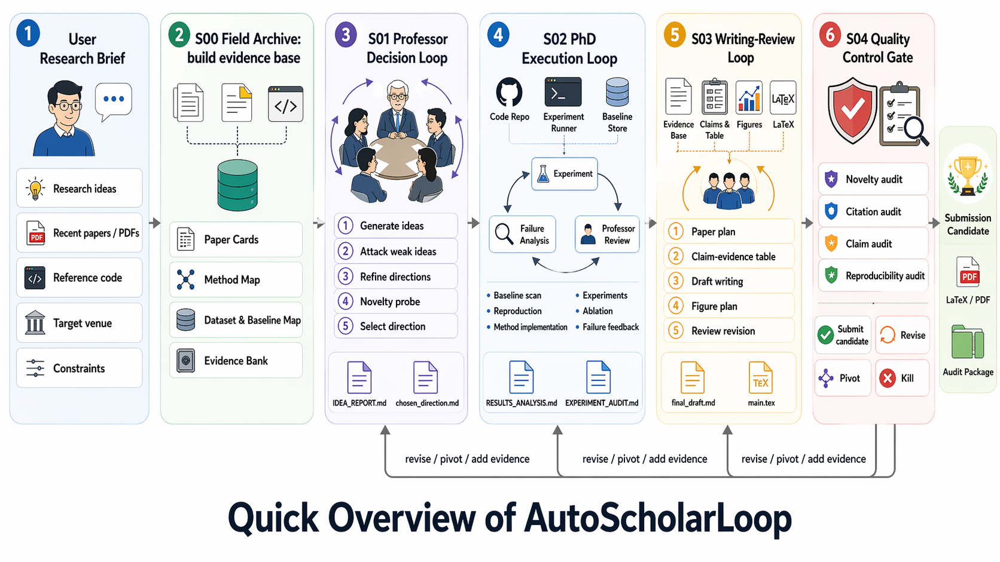
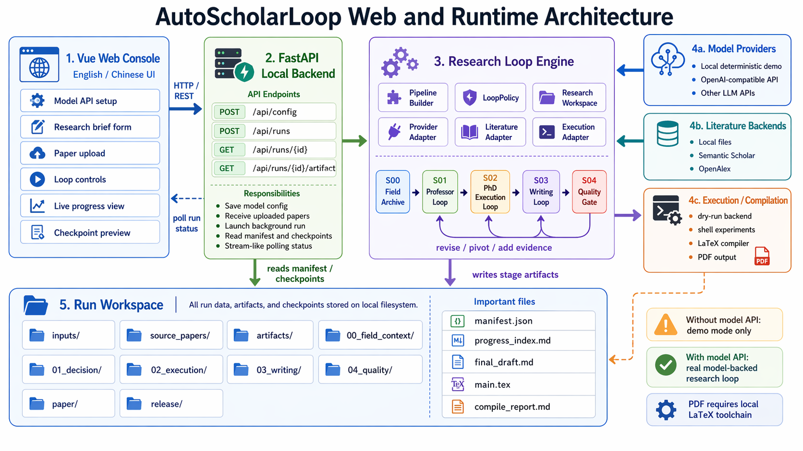

# AutoScholarLoop

[English](README.md) | [中文](README_CN.md)

**AutoScholarLoop** is an auditable AUTO Research framework that organizes
research automation as a staged, multi-agent loop. It turns a seed idea,
reference notes, local papers, and optional execution backends into a visible
research process with checkpoints, manuscript artifacts, bibliography outputs,
and quality gates.

Developed for research automation scenarios at AI Group, CAS CNIC
(Computer Network Information Center, Chinese Academy of Sciences).

AI Group  


## What Is New In This Version

This version completes the first usable reference-management loop inside the
research pipeline:

- normalized bibliography metadata is built in `S00`;
- references are deduplicated and assigned stable cite keys;
- `S03` now writes `paper/references.bib`;
- Markdown draft generation now inserts inline cite markers;
- LaTeX export now renders a bibliography section from normalized entries;
- `S04` now performs a real citation audit instead of a placeholder-only note;
- citation audit reports blocking issues separately from metadata warnings.

The current implementation already supports unified metadata normalization for
future multilingual retrieval. Chinese literature sources are not fully wired
yet, but the schema now includes `language`, `source`, `doi`, `source_id`,
`entry_type`, and `note` so Chinese providers can be added without another
format migration.

## Pipeline

AutoScholarLoop simulates a small research group rather than a single chatbot.
The default staged loop is:

1. `S00` Field Archive: build field map, paper cards, evidence bank, and
   normalized reference inventory.
2. `S01` Professor Decision: generate, criticize, rank, and select directions.
3. `S02` PhD Execution: plan baselines, implement, run, and summarize results.
4. `S03` Writing Review: create paper plan, claim-evidence table, draft,
   `references.bib`, and LaTeX export.
5. `S04` Quality Gate: audit novelty, citations, reproducibility, claim
   support, and release readiness.

```text
S00 evidence preparation
  -> S01 professor decision loop
  -> S02 execution-review loop
  -> S03 writing-review loop
  -> S04 quality gate
  -> submission_candidate / revise / pivot / kill
```

Every stage writes Markdown checkpoints and structured artifacts so users can
inspect why a direction was selected, what evidence exists, which references
were used, and why the quality gate passed or failed.

## Current Capabilities

- Multi-stage AUTO Research loop with explicit checkpoints and manifest-backed
  artifacts.
- Deterministic local provider for offline demos and smoke runs.
- OpenAI-compatible provider adapter for real model APIs.
- Literature adapters for `local`, `semanticscholar`, and `openalex`.
- Unified bibliography metadata normalization with cite-key generation.
- BibTeX generation to `paper/references.bib`.
- Citation audit outputs in `04_quality/CITATION_AUDIT.md` and `.json`.
- Dry-run and shell execution backends.
- Format-aware paper writing for `acm`, `ieee`, `springer_lncs`, and
  `chinese_thesis`.
- Markdown and LaTeX manuscript export.
- Optional PDF compilation when `--compile-pdf` is enabled and the required
  local LaTeX toolchain exists.
- Vue Web console for run launch, progress inspection, and artifact preview.



## Installation

```powershell
cd AutoScholarLoop
pip install -e ".[api,web,dev]"
```

For the Web frontend:

```powershell
cd web
npm install
```

## CLI Quick Start

```powershell
autoscholarloop run `
  --seed "I want to study retrieval-augmented agents for scientific writing." `
  --loop-mode fast `
  --paper-format ieee `
  --workspace runs/demo
```

With references and literature retrieval:

```powershell
autoscholarloop run `
  --seed "your research idea" `
  --reference "paper title, URL, local path, or note" `
  --reference ".\\papers\\example.pdf" `
  --num-ideas 5 `
  --loop-mode standard `
  --paper-format acm `
  --literature semanticscholar `
  --execution-backend dry-run `
  --review-ensemble 5 `
  --compile-pdf `
  --workspace runs/demo
```

By default, `local` provider mode is a deterministic demo. For real runs,
configure an OpenAI-compatible model provider and API key.

## Reference Workflow

The new reference path is:

1. User supplies references through `--reference`, uploaded files, or external
   literature lookup.
2. `S00` normalizes each record into a shared bibliography schema.
3. Entries are deduplicated and assigned stable cite keys.
4. `S03` writes:
   - `00_field_context/reference_inventory.md`
   - `00_field_context/reference_inventory.json`
   - `03_writing/reference_inventory.md`
   - `paper/references.bib`
5. Draft text uses inline cite markers such as `[@key]`.
6. `S04` checks whether cited keys resolve, whether metadata is incomplete, and
   whether duplicated title groups remain.

Blocking conditions:

- cited key missing from bibliography;
- no inline citations found in the manuscript draft.

Warnings:

- incomplete metadata such as missing author, year, DOI, URL, or source ID;
- duplicated normalized title groups.

## Web Console

Start the Python API:

```powershell
autoscholarloop web --host 127.0.0.1 --port 8000
```

Start the Vue frontend:

```powershell
cd web
npm run dev
```

The Web console supports:

- provider configuration;
- research direction and target venue input;
- PDF, Markdown, text, and BibTeX upload;
- loop mode and backend selection;
- manuscript format selection;
- live `S00` to `S04` progress visualization;
- checkpoint preview for field maps, idea reports, execution analysis, paper
  plans, claim evidence, final gate, and final draft.

## Generated Workspace

Each run creates an auditable workspace:

```text
run/
  source_papers/
  inputs/
  artifacts/
  logs/
  00_field_context/
  01_decision/
  02_execution/
  03_writing/
  04_quality/
  paper/
  release/
```

Important outputs include:

- `00_field_context/field_map.md`
- `00_field_context/paper_cards.md`
- `00_field_context/reference_inventory.md`
- `01_decision/IDEA_REPORT.md`
- `02_execution/RESULTS_ANALYSIS.md`
- `03_writing/PAPER_PLAN.md`
- `03_writing/claim_evidence_table.md`
- `paper/references.bib`
- `paper/main.tex`
- `04_quality/CITATION_AUDIT.md`
- `04_quality/CITATION_AUDIT.json`
- `04_quality/final_gate.md`
- `paper/final_draft.md`
- `release/README.md`

## Paper Formats

Supported manuscript targets:

- `acm`
- `ieee`
- `springer_lncs`
- `chinese_thesis`

The generated manuscript is an auditable draft package, not a guarantee of
venue compliance. Official venue class files, bibliography styles, and policy
checks still need human verification.

## Limitations

- Chinese literature providers are not fully integrated yet.
- Citation audit currently verifies internal consistency of bibliography and
  cite usage, not full web-scale truth verification.
- Literature retrieval quality depends on the configured adapter.
- Real experimental validity and submission readiness still require human
  review.

## Development

Run tests:

```powershell
$env:PYTHONPATH='src'
python -m pytest tests -q
```

Build the Web frontend:

```powershell
cd web
npm run build
```

## Repository Layout

```text
docs/                          Design, roadmap, workflow, and version notes
src/open_research_agent/       Python research loop package
web/                           Vue Web console
configs/                       Example pipeline configs
templates/                     Research workspace templates
examples/                      Example inputs
tests/                         Smoke tests
```

## License & Responsible Use

This project is licensed under **The AI Scientist Source Code License**, a
derivative of the Responsible AI License.

**Mandatory disclosure:** if you use this code in a paper or scientific
manuscript, you must clearly disclose the use of AI in accordance with the
license and venue policy.

Users remain responsible for verifying claims, references, experiments,
authorship requirements, venue rules, and disclosure obligations before
submission.
