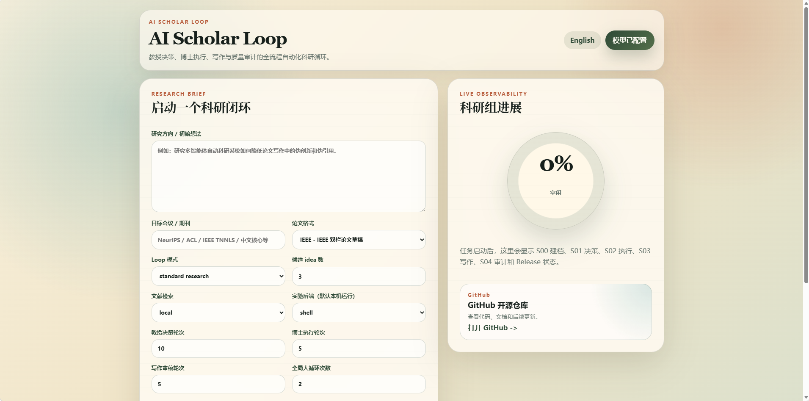

# AutoScholarLoop

[English](README.md) | [中文](README_CN.md)

**AutoScholarLoop** 是一套面向自动化科研流程的开源 AUTO Research 框架。它把研究方向、参考论文、笔记、BibTeX、可选代码和目标投稿格式组织成一个可审计的多智能体科研闭环，用于完成文献建档、idea 生成与筛选、实验执行、论文写作、质量审计和投稿候选包生成。

项目面向 **CAS CNIC，中国科学院计算机网络信息中心 AI Group** 的科研自动化场景开发。系统不是一个单轮聊天机器人，而是模拟一个小型科研组：教授组负责决策，博士组负责执行，写作组负责成稿，质量控制组负责审计。


## 项目亮点

- **多阶段科研闭环**：覆盖 S00 领域建档、S01 教授决策、S02 博士执行、S03 写作审稿、S04 质量门控和 release 打包。
- **可审计产物**：每个阶段都会写入 Markdown checkpoint、结构化日志、manifest 和最终论文草稿，方便复盘每个结论来自哪里。
- **Web 控制台**：提供模型配置、研究任务提交、文件上传、实时进度、日志展开、checkpoint 预览和产物下载。
- **CLI 与 Web 共用核心 pipeline**：命令行批处理和网页操作调用同一套研究循环逻辑，便于调试、集成和自动化运行。
- **支持真实模型 API**：通过 OpenAI-compatible 适配器接入 DeepSeek、OpenAI 或其他兼容服务。
- **支持离线演示模式**：local deterministic provider 可用于本地 demo、测试和页面演示，但不会产生真实科研结论。
- **支持文献后端**：可使用 local、Semantic Scholar 或 OpenAlex 作为文献检索/引用辅助来源。
- **支持本地实验执行**：dry-run 用于安全演示，shell 模式会把生成代码写入 `code/` 并在当前机器运行命令。
- **支持多种论文格式**：内置 `ieee`、`acm`、`springer_lncs`、`chinese_thesis` 等 manuscript target。
- **支持 LaTeX/PDF 输出**：系统总会生成 `paper/main.tex`，启用 `--compile-pdf` 且本机 LaTeX 环境可用时会尝试编译 PDF。



## 工作流总览

AutoScholarLoop 的核心流程是一个嵌套科研循环：

```text
S00 证据准备
  -> S01 教授决策 loop
  -> S02 执行-复盘 loop
  -> S03 写作-审稿 loop
  -> S04 质量 gate
  -> submission_candidate / revise / pivot / kill
```

各阶段职责如下：

| 阶段 | 名称 | 主要任务 | 典型输出 |
| --- | --- | --- | --- |
| S00 | Field Archive Group | 读取输入材料，建立领域地图、论文卡片、方法地图、数据集/baseline 地图和证据库 | `field_map.md`、`paper_cards.md`、`progress_index.md` |
| S01 | Professor Decision Group | 多轮生成 idea、互相批判、查新、排序并选择研究方向 | `IDEA_REPORT.md`、`chosen_direction.md` |
| S02 | PhD Execution Group | 规划 baseline、生成代码、运行实验、分析失败并形成复盘 memo | `GENERATED_CODE.md`、`RESULTS_ANALYSIS.md`、`CLAIMS_FROM_RESULTS.md` |
| S03 | Writing Group | 根据证据生成论文计划、claim-evidence 表、初稿、图表计划和修订稿 | `PAPER_PLAN.md`、`claim_evidence_table.md`、`final_draft.md` |
| S04 | Quality Control Group | 审计创新性、引用、可复现性、unsupported claims 和最终发布状态 | `CITATION_AUDIT.md`、`final_gate.md`、`compile_report.md` |
| Release | Release Package | 打包最终论文、LaTeX、PDF、manifest 或修订说明 | `release/README.md`、`REVISION_REQUIRED.md` |

## Web 页面功能

Web 控制台由 Vue 前端和 FastAPI 后端组成，适合第一次配置、演示运行和观察科研循环过程。

### 1. 模型 API 配置

页面右上角点击 **Configure Model API / 配置模型 API**，可以选择：

- `Local demo`：本地 deterministic 演示模式，不调用真实大模型。
- `DeepSeek`：预填 `deepseek-chat` 和 `https://api.deepseek.com/v1`。
- `OpenAI`：预填 OpenAI-compatible base URL。
- `Custom OpenAI-compatible`：填写自定义模型名、Base URL 和 API Key。

如果所在网络环境中系统代理会影响 `httpx` 连接，可以关闭“使用系统代理环境变量”，等价于设置：

```powershell
$env:AUTOSCHOLARLOOP_HTTP_TRUST_ENV='0'
```

### 2. Research Brief 任务表单

左侧表单用于提交一次科研循环：

- **Research Direction / Initial Idea**：输入研究方向或初始想法。
- **Target Conference / Journal**：输入目标会议、期刊或毕业论文要求。
- **Paper Format**：选择 IEEE、ACM、Springer LNCS 或中文学位论文。
- **Loop Mode**：选择 `fast demo`、`standard research` 或 `strict review`。
- **Candidate Ideas**：控制候选 idea 数量。
- **Literature Backend**：选择 local、Semantic Scholar 或 OpenAlex。
- **Execution Backend**：选择 dry-run 或 shell。
- **Decision / Execution / Writing Rounds**：分别控制教授组、博士组、写作组轮次。
- **Global Big Loops**：控制全局大循环次数。
- **Attempt PDF Compilation**：勾选后尝试本地 LaTeX 编译。
- **Demo mode**：未配置真实 API 时，允许 local provider 演示运行。
- **Upload Recent Papers / Notes**：上传 PDF、Markdown、TXT 或 BibTeX 作为参考材料。

### 3. 实时进度和日志

右侧 **Research Group Progress** 会显示整体进度百分比和 S00-S04 阶段状态。任务运行时可以展开运行日志，查看每个 checkpoint 何时生成，也可以点击日志项直接打开对应产物预览。

### 4. Checkpoint 预览

运行开始后，下方 **Stage Checkpoints** 区域会出现阶段性产物按钮，例如 Field Map、Idea Report、Generated Code、Execution Analysis、Paper Plan、Claim Evidence、Final Gate、LaTeX Main、Compile Report 和 Final Draft。

### 5. 下载产物

运行完成后，右侧 **Downloads** 区域会显示可下载文件：`paper/main.tex`、`paper/main.pdf`、`paper/final_draft.md`、`manifest.json` 和必要时生成的 `release/REVISION_REQUIRED.md`。

## 页面预览

Web 控制台首页已经集成研究任务表单和实时进度面板。用户可以在同一个页面完成模型配置、研究方向填写、参考材料上传、循环轮次调整、任务启动、checkpoint 预览和最终产物下载。

当前 README 中的页面截图展示了中文界面首屏，英文版 README 展示了英文界面首屏。实际运行时可以通过右上角语言按钮在中英文之间切换。

## 安装

要求：

- Python 3.10 或更高版本
- Node.js，建议 Node 18+
- 可选：本地 LaTeX 工具链，例如 TeX Live、MiKTeX、MacTeX
- 可选：真实大模型 API Key，例如 DeepSeek、OpenAI 或其他 OpenAI-compatible 服务

安装 Python 包：

```powershell
cd AutoScholarLoop
pip install -e ".[api,web,dev]"
```

安装前端依赖：

```powershell
cd web
npm install
```

## Web 快速开始

启动 Python API：

```powershell
autoscholarloop web --host 127.0.0.1 --port 8000
```

启动 Vue 前端：

```powershell
cd web
npm run dev
```

打开 Vite 输出的地址，通常是：

```text
http://localhost:5173
```

如果前端需要连接其他 API 地址，可以设置：

```powershell
$env:VITE_API_BASE='http://127.0.0.1:8000'
npm run dev
```

## CLI 快速开始

本地 deterministic demo：

```powershell
autoscholarloop run `
  --seed "I want to study retrieval-augmented agents for scientific writing." `
  --loop-mode fast `
  --paper-format ieee `
  --workspace runs/demo
```

真实模型运行示例，以 DeepSeek-compatible API 为例：

```powershell
$env:OPENAI_API_KEY='your_api_key'
$env:AUTOSCHOLARLOOP_HTTP_TRUST_ENV='0'

autoscholarloop run `
  --seed "your research idea" `
  --provider openai-compatible `
  --model deepseek-chat `
  --base-url https://api.deepseek.com/v1 `
  --num-ideas 5 `
  --loop-mode standard `
  --paper-format ieee `
  --literature semanticscholar `
  --execution-backend shell `
  --compile-pdf `
  --workspace runs/deepseek_demo
```

常用参数：

| 参数 | 作用 |
| --- | --- |
| `--seed` | 研究方向、初始想法或任务说明 |
| `--reference` | 参考论文标题、URL、本地路径或笔记，可重复传入 |
| `--provider` | `local` 或 `openai-compatible` |
| `--model` | 模型名，例如 `deepseek-chat`、`gpt-4.1` |
| `--base-url` | OpenAI-compatible API base URL |
| `--num-ideas` | 候选 idea 数量 |
| `--loop-mode` | `fast`、`standard`、`strict` |
| `--decision-rounds` | 覆盖教授组决策轮次 |
| `--execution-rounds` | 覆盖博士组执行轮次 |
| `--writing-rounds` | 覆盖写作组审稿轮次 |
| `--max-big-loops` | 覆盖全局大循环次数 |
| `--literature` | 文献后端：`local`、`semanticscholar`、`openalex` |
| `--execution-backend` | 执行后端：`dry-run` 或 `shell` |
| `--review-ensemble` | 聚合 reviewer 样本数量 |
| `--compile-pdf` | 尝试编译 PDF |
| `--paper-format` | `ieee`、`acm`、`springer_lncs`、`chinese_thesis` |

批量运行：

```powershell
autoscholarloop batch `
  --seed-file examples/seed.txt `
  --workspace-root runs/batch_demo `
  --parallel 2 `
  --provider local `
  --loop-mode fast
```

兼容旧命令：

```powershell
new-ai-scientist run --seed "your idea" --workspace runs/demo
```

## 输出目录

每次运行都会生成一个可审计 workspace：

```text
run/
  source_papers/          上传或传入的参考材料
  inputs/                 结构化输入
  artifacts/              中间产物
  logs/                   运行日志和 shell 执行记录
  code/                   生成的方法代码、实验脚本和结果文件
  00_field_context/       S00 领域建档
  01_decision/            S01 idea 生成、批判、排序和选择
  02_execution/           S02 执行、实验和结果分析
  03_writing/             S03 论文计划、证据表和草稿
  04_quality/             S04 质量审计和最终 gate
  paper/                  Markdown、LaTeX 和可选 PDF
  release/                发布包或修订说明
```

重要文件：

- `code/experiments/run_experiment.py`
- `code/methods/proposed_method.py`
- `code/experiments/result.json`
- `00_field_context/field_map.md`
- `00_field_context/paper_cards.md`
- `00_field_context/progress_index.md`
- `01_decision/IDEA_REPORT.md`
- `01_decision/chosen_direction.md`
- `02_execution/GENERATED_CODE.md`
- `02_execution/RESULTS_ANALYSIS.md`
- `02_execution/CLAIMS_FROM_RESULTS.md`
- `02_execution/EXPERIMENT_AUDIT.md`
- `03_writing/PAPER_PLAN.md`
- `03_writing/claim_evidence_table.md`
- `04_quality/CITATION_AUDIT.md`
- `04_quality/final_gate.md`
- `04_quality/compile_report.md`
- `paper/final_draft.md`
- `paper/main.tex`
- `paper/main.pdf`，如果本地 LaTeX 编译成功
- `release/README.md`
- `release/REVISION_REQUIRED.md`，如果质量门控没有通过
- `manifest.json`

## 论文格式说明

当前支持四类 manuscript target：

- `ieee`：IEEE 风格会议或期刊论文草稿。
- `acm`：ACM 风格会议或期刊论文草稿。
- `springer_lncs`：Springer LNCS proceedings 风格草稿。
- `chinese_thesis`：通用中文学位论文结构草稿。

注意：系统生成的是研究草稿和审计包，不保证完全符合具体会议/期刊模板。正式投稿前仍需人工检查官方 class 文件、引用格式、页数限制、伦理声明、作者署名和 AI 使用披露要求。

## 仓库结构

```text
docs/                         架构、路线图、工作流契约和版本说明
src/open_research_agent/       Python 核心 pipeline、stage、provider 和 Web API
web/                           Vue Web 控制台
configs/                       示例 pipeline 配置
templates/                     workspace 模板
examples/                      示例输入
tests/                         smoke tests
img/                           README 展示图和页面截图
```

## 开发与测试

运行测试：

```powershell
$env:PYTHONPATH='src'
python -m pytest tests -q
```

构建前端：

```powershell
cd web
npm run build
```

健康检查：

```powershell
autoscholarloop web --host 127.0.0.1 --port 8000
curl http://127.0.0.1:8000/api/health
```

## 使用边界

AutoScholarLoop 可以帮助组织科研流程、生成候选 idea、写代码、运行本地命令、整理证据并生成论文草稿，但它不能替代研究者的判断。

使用时需要人工重点检查：

- idea 是否真的新颖；
- 文献引用是否准确；
- 实验是否真实、可复现且设置公平；
- 数据集、baseline、训练脚本和硬件环境是否可靠；
- 论文中的 claim 是否被结果支持；
- 目标会议/期刊是否允许或要求披露 AI 辅助；
- 作者署名、伦理合规和数据使用许可是否满足要求。

## License & Responsible Use

This project is licensed under **The AI Scientist Source Code License**, a derivative of the Responsible AI License.

**强制披露要求**：使用本代码产生的科研论文或 manuscript，必须清楚、显著地披露 AI 的参与。

建议在论文 Abstract 或 Methods 中加入类似说明：

> "This manuscript was autonomously generated using AutoScholarLoop, an AI-assisted research-loop system inspired by The AI Scientist."

用户需要自行验证所有 claim、引用、实验、署名、投稿政策和 AI 使用披露义务。
